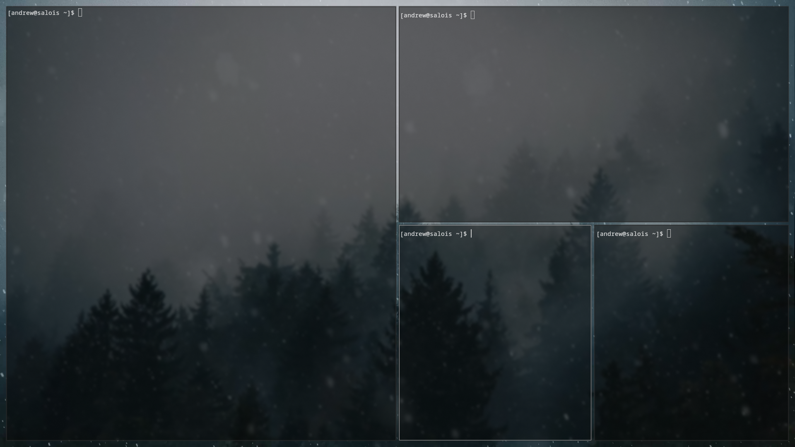
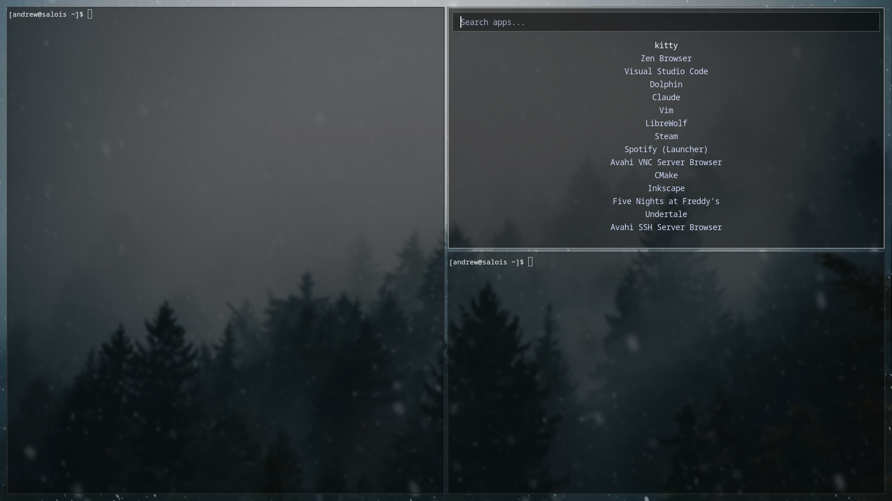

__FULLMETAL-ARCH MK-III__

_(Testing and working on both upstream and Asahi ALARM Linux!)_

__DEFAULT KEYBINDS:__ (That differ from standard Hyprland)
   __SUPER__ -> Open the launcher

   __SUPER + F__ -> Toggle floating window  
   __SUPER + (Drag with left click)__ -> Move a window  
   __SUPER + SHIFT + (Drag with left click)__ -> Resize a window  
   __SUPER + Q__ -> Close a window

   __SUPER + W__ -> Open favorite web-browser  
   __SUPER + E__ -> Open favorite file-manager  
   __SUPER + R__ -> Open favorite terminal  
   __SUPER + T__ -> Open favorite text editor  
   
   __SUPER + P__ -> Take a screenshot
   

__DEPENDENCIES:__  
Hyprland, Rofi, mpvpaper, grim, kitty
